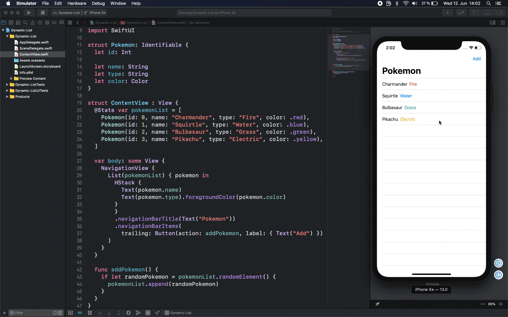

# Dynamic List 
### Tutorials to learn to build this project
*We create an array of pokemons and have the new List
view be populated based on that array. We then add a
Navigation view and a button in order to add a random new pokemon to our List ✨*

📖 **Article: [Dynamic List](https://medium.com/@martinlasek/swiftui-dynamic-list-identifiable-73c56215f9ff)**
 
🎥 **Video: [Dynamic List](https://youtu.be/51DF0UPoVUM)**

